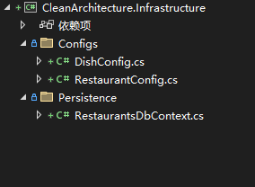

# Entity Framework  

## 安装EntityFramework包    

在CleanArchitecture.Infrastructure(基础设施层)项目中安装EntityFramework包  

```bash
Install-Package Microsoft.EntityFrameworkCore.SqlServer -Version 8.0.0  
Install-Package Microsoft.EntityFrameworkCore.Tools -Version 8.0.0  
```  

### commands
```bash
Add-Migration  
Bundle-Migration  
Drop-Database  
Get-DbContext 
Get-Migration  
Optimize-DbContext  
Remove-Migration  
Scaffold-DbContext  
Script-Migration  
Update-Database  
```  

:::{note}  
这里没有按照视频教学，使用 Fluent API 来配置实体关系  
::: 

## Infrastructure(基础设施层)结构图  

  

### RestaurantsDbContext

```csharp
:tags: [hide-cell, thebe-init]


using CleanArchitecture.Domain.Entities;
using Microsoft.EntityFrameworkCore;

namespace CleanArchitecture.Infrastructure.Persistence;

internal class RestaurantsDbContext : DbContext
{
    internal DbSet<Restaurant> Restaurants { get; set; }
    internal DbSet<Dish> Dishes { get; set; }

    protected override void OnConfiguring(DbContextOptionsBuilder optionsBuilder)
    {
        optionsBuilder.UseSqlServer("Server=.;Database=restaurant;User ID=sa;Password=123456;TrustServerCertificate=True;");
    }

    protected override void OnModelCreating(ModelBuilder modelBuilder)
    {
        base.OnModelCreating(modelBuilder);
        modelBuilder.ApplyConfigurationsFromAssembly(GetType().Assembly);
    }
}
```  

### RestaurantConfig

```csharp
using CleanArchitecture.Domain.Entities;
using Microsoft.EntityFrameworkCore;
using Microsoft.EntityFrameworkCore.Metadata.Builders;

namespace CleanArchitecture.Infrastructure.Configs;

public class RestaurantConfig : IEntityTypeConfiguration<Restaurant>
{
    public void Configure(EntityTypeBuilder<Restaurant> builder)
    {
        builder.ToTable($"T_{nameof(Restaurant)}", t => t.HasComment("餐厅"));
        builder.HasKey(t => t.Id);
        builder.Property(t => t.Name).IsRequired().HasComment("餐厅名");
        builder.Property(t => t.Description).IsRequired().HasComment("餐厅介绍");
        builder.Property(t => t.Category).IsRequired().HasComment("餐厅分类");
        builder.Property(t => t.HasDelivery).HasComment("是否配送");
        builder.Property(t => t.ContactEmail).HasComment("邮箱");
        builder.Property(t => t.ContactNumber).HasComment("联系号码");
        builder.OwnsOne(t => t.Address, a =>
        {
            a.Property(ad => ad.Street).HasComment("街道");
            a.Property(ad => ad.City).HasComment("城市");
            a.Property(ad => ad.PostalCode).HasComment("邮政编码");
        });
    }
}
```  

### DishConfig

```csharp
using CleanArchitecture.Domain.Entities;
using Microsoft.EntityFrameworkCore;
using Microsoft.EntityFrameworkCore.Metadata.Builders;

namespace CleanArchitecture.Infrastructure.Configs;

public class DishConfig : IEntityTypeConfiguration<Dish>
{
    public void Configure(EntityTypeBuilder<Dish> builder)
    {
        builder.ToTable($"T_{nameof(Dish)}", t => t.HasComment("菜单"));
        builder.HasKey(t => t.Id);
        builder.Property(t => t.Name).IsRequired().HasComment("菜单名");
        builder.Property(t => t.Description).IsRequired().HasComment("菜单介绍");
        builder.Property(t => t.Price).IsRequired().HasComment("价格");
        // 外键配置
        builder.HasOne<Restaurant>()
               //.WithMany()  // 如果 Restaurant 没有导航属性指向 Dish，可以保持这样
               .WithMany(r => r.Dishes)  // 如果 Restaurant 有 Dishes 导航属性
               .HasForeignKey(t => t.RestaurantId)
               .OnDelete(DeleteBehavior.Cascade);  // 可选：级联删除
    }
}
```

## 运行  
1. 启动项设置Infrastructure  
2. 程序包管理器设置Infrastructure  
3. 运行Add-Migration InitialCreate
4. 运行Update-Database
5. 查看数据库是否生成  