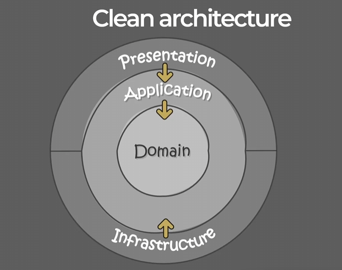

# Web API Clean Architecture

Asp.Net Core 8 Web Api： 简洁架构 + Azure 服务 

:::{note}  
仓库地址 [github](https://github.com/Abner1995/code/tree/master/csharp/code/CleanArchitecture)  
视频教学 [bilibili](https://www.bilibili.com/video/BV1zS411N7F5/?spm_id_from=333.788.top_right_bar_window_custom_collection.content.click&vd_source=1f83a0bae14ae5b8eebb025a6b0e7af7)  
视频仓库地址 [github](https://github.com/jakubkozera/Restaurants)  
:::  

## 结构示意图  

  

1. Domain Layer (领域层)
   - 核心业务逻辑：这是系统的核心，包含了业务规则和业务逻辑。它定义了系统的核心功能和数据模型。  
   - 独立于其他层：Domain 层不依赖于其他层，而是其他层依赖于它。这意味着即使没有用户界面或数据库，Domain 层仍然可以独立存在。  
   - 实体和聚合：包含实体（Entity）和聚合（Aggregate），这些是业务逻辑的核心组件。  
2. Application Layer (应用层)  
    - 协调业务逻辑：这一层负责协调 Domain 层中的业务逻辑，处理业务流程和事务。  
    - 接口适配器：Application 层通过接口适配器（如 Repository 接口）与 Infrastructure 层交互，通过控制器（如 MVC 控制器）与 Presentation 层交互。  
   - 用例：包含用例（Use Case），这些是业务流程的具体实现。  
3. Presentation Layer (表示层)
    - 用户界面：这一层负责处理用户界面（UI）相关的逻辑，包括视图和控制器。  
    - 视图和控制器：包含视图（View）和控制器（Controller），负责展示数据和处理用户输入。  
    - 依赖于 Application 层：Presentation 层依赖于 Application 层提供的接口来获取数据和处理业务逻辑。  
4. Infrastructure Layer (基础设施层)   
    - 外部系统交互：这一层负责与外部系统（如数据库、文件系统、网络服务等）的交互。  
    - 实现接口适配器：实现 Application 层定义的接口适配器，如 Repository 接口的具体实现。  
    - 依赖于其他层：Infrastructure 层依赖于 Application 层提供的接口，但其他层不依赖于它。  
    
### 依赖方向
   - 箭头方向：箭头表示依赖方向。Domain 层是核心，其他层依赖于它，但 Domain 层不依赖于其他层。
   - 内聚和解耦：这种结构确保了内聚性（每一层都有明确的职责）和解耦性（每一层之间的依赖关系是单向的），从而提高了系统的可维护性和可测试性。

:::{seealso}  
- Application项目引用Domain  
- API项目引用Application    
- API项目引用Infrastructure      
- Infrastructure项目引用Application  
:::
   

## 好处  

1. Testabillty： 系统、组件或软件能够被测试的容易程度  
2. UI independence： 应用程序的用户界面部分应该与业务逻辑和数据处理部分分离  
3. Free to choose/change the database： 自由选择或更换数据库技术的能力  
4. Flexibility： 系统能够适应变化、扩展或调整的能力、灵活性  
5. Transparency： 开放性和可访问性  

```{toctree}
HTTPClient
solutionModules
Entities
EntityFramework
FlexibleDatabaseConnection
Seeder
Retrievingentities
RetrievingDTOs
Validation
CQRSwithMediatR
Log
Exceptions
ASPNETIdentity
UserContext
```