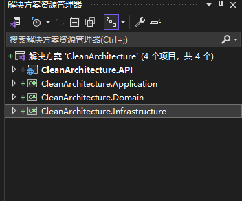

# solution modules  

## 项目结构图  

  

1. Domain Layer (领域层)
2. Application Layer (应用层)  
3. Presentation Layer (表示层)
4. Infrastructure Layer (基础设施层)   

## 项目引用  

1. CleanArchitecture.Application项目引用CleanArchitecture.Domain  
2. CleanArchitecture.API项目引用CleanArchitecture.Application    
3. CleanArchitecture.Infrastructure项目引用CleanArchitecture.Application