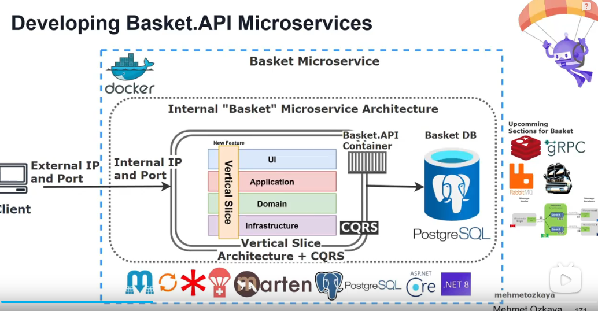

# Basket.API

垂直切片架构

Basket.API
包
AspNetCore.HealthChecks.NpgSql
AspNetCore.HealthChecks.Redis
AspNetCore.HealthChecks.UI.Client
Carter 
Grpc.AspNetCore
Marten
Microsoft.Extensions.Caching.StackExchangeRedis
Microsoft.VisualStudio.Azure.Containers.Tools.Targets
Scrutor

Grpc.AspNetCore要与Discount.Grpc版本一致