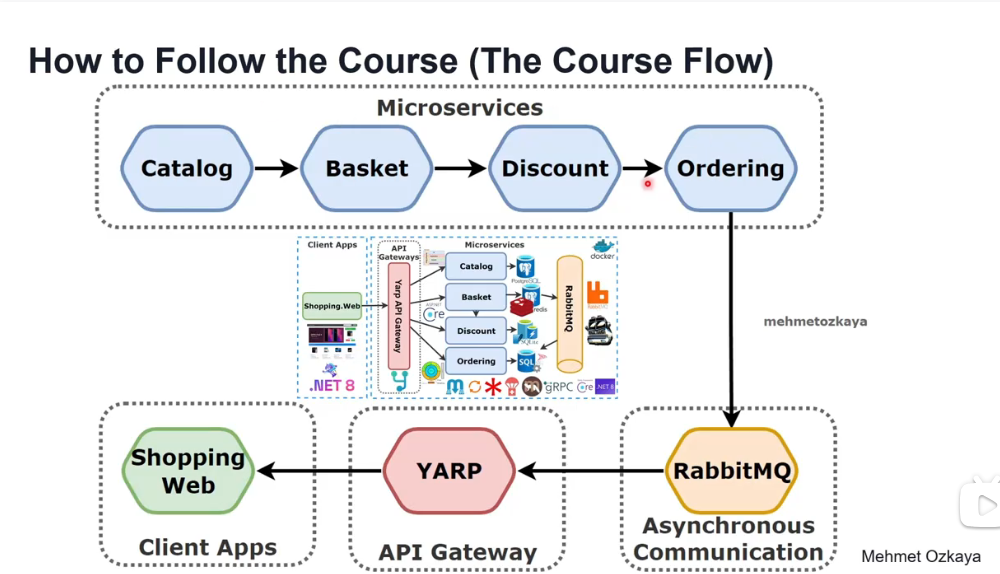

# .NET 8 Microservices DDD, CQRS, VerticalClean Architecture

将学习如何在使用 Asp.Net Web API、Docker、RabbitMQ、MassTransit、Grpc、Yarp API Gateway、PostgreSQL、Redis、SQLite、SqlServer、Marten、Entity Framework Core、CQRS、MediatR、DDD、垂直和干净架构实现的 .NET 平台上构建微服务，这些平台在云原生环境中使用 .NET 8 的最新代码和最佳实践。

您将使用 NoSQL（PostgreSQL DocumentDB、Redis）和关系数据库（SQLite、Sql Server）通过产品、购物篮、折扣和订购微服务开发电子商务模块，并通过 RabbitMQ 事件驱动通信和 Yarp API 网关进行通信。您可以在 .NET 上找到微服务体系结构和分步实现，它们通过大量解释和详细信息逐步开发本课程。

除此之外，你还将开发以下微服务和项：

目录微服务，包括;

ASP.NET Core Minimal API 以及 .NET 8 和 C# 12 的最新功能

使用要素文件夹的垂直切片架构实现

使用 MediatR 库实现 CQRS

CQRS系列 使用 MediatR 和 FluentValidation 的验证管道行为

PostgreSQL 上 .NET 事务文档数据库的 Marten 库

用于最小 API 端点定义的 Carter 库

跨领域关注点日志记录、全局异常处理和运行状况检查

用于在 Docker 环境中运行多容器的 Dockerfile 和 docker-compose 文件

篮子微服务，包括;

ASP.NET 8 Web API 应用程序、遵循 REST API 原则、CRUD 操作

Redis 作为 basketdb 上的分布式缓存

实现代理、装饰器和缓存端设计模式

消费 用于服务间同步通信以计算产品最终价格的折扣 gRPC 服务

发布 使用 MassTransit 和 RabbitMQ 的 BasketCheckout 队列

折扣微服务，包括;

ASP.NET gRPC Server 应用程序

使用 Basket 微服务构建高性能的服务间 gRPC 通信

通过创建 Protobuf 消息公开 gRPC 服务

Entity Framework Core ORM - SQLite 数据提供程序和迁移

SQLite数据库连接和容器化

微服务通信

同步服务间 gRPC 通信

与 RabbitMQ Message-Broker Service 进行异步微服务通信

使用 RabbitMQ 发布/订阅主题交换模型

使用 MassTransit 在 RabbitMQ Message-Broker 系统上进行抽象

从 Basket 微服务发布 BasketCheckout 事件队列和从订购微服务订阅此事件

创建 RabbitMQ EventBus.Messages 库并添加引用微服务

订购微服务

使用最佳实践实施 DDD、CQRS 和干净架构

使用 MediatR、FluentValidation 和 Mapster 软件包开发 CQRS

使用域事件和集成事件

实体框架核心代码优先方法、迁移、DDD 实体配置

使用 MassTransit-RabbitMQ 配置使用 RabbitMQ BasketCheckout 事件队列

SqlServer 数据库连接和容器化

使用实体框架核心 ORM 并在应用程序启动时自动迁移到 SqlServer

Yarp API 网关微服务

使用 Yarp 反向代理实施 API 网关，应用网关路由模式

Yarp 反向代理配置;路由、集群、路径、转换、目标

在 Yarp 反向代理配置上使用 FixedWindowLimiter 进行速率限制

用于通过 API 网关重新路由的示例微服务/容器

WebUI 购物应用微服务

:::{note}  
仓库地址 [github](https://github.com/Abner1995/code/tree/master/csharp/code/EShopMicroservices)  
视频教学 [bilibili](https://www.bilibili.com/video/BV1Cf421Z78a?spm_id_from=333.788.player.switch&vd_source=1f83a0bae14ae5b8eebb025a6b0e7af7&p=7)  
视频仓库地址 [github](https://github.com/mehmetozkaya/EShopMicroservices/tree/main)  
:::  



```{toctree}
BuildingBlocks/index
Catalog.API/index
Basket.API/index
Discount.Grpc/index
Order/index
APIGateWay/index
```