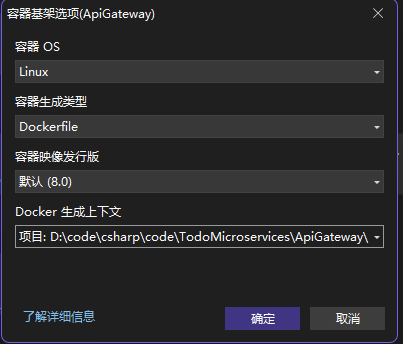
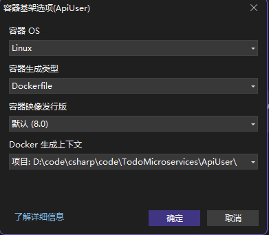

# ApiGatewaySimple

ApiGateway+apiuser简单示例  

## 安装Ocelot包  
```bash
Install-Package Ocelot 
Install-Package Ocelot.Provider.Consul      # 如果需要服务发现
Install-Package Ocelot.Provider.Polly       # 熔断支持
Install-Package Microsoft.AspNetCore.Authentication.JwtBearer # JWT验证
```  

## ApiGateway

### 基础配置 (Program.cs)
```csharp
using Ocelot.DependencyInjection;
using Ocelot.Middleware;

var builder = WebApplication.CreateBuilder(args);

// 添加Ocelot并加载配置文件
builder.Configuration.AddJsonFile("ocelot.json", optional: false, reloadOnChange: true);
builder.Services.AddOcelot(builder.Configuration);

builder.Services.AddControllers();
builder.Services.AddEndpointsApiExplorer();
builder.Services.AddSwaggerGen();

var app = builder.Build();

if (app.Environment.IsDevelopment())
{
    app.UseSwagger();
    app.UseSwaggerUI();
}

app.UseHttpsRedirection();

app.UseAuthorization();

app.MapControllers();

// Ocelot中间件必须在UseRouting之后
await app.UseOcelot();

app.Run();
```


### ocelot.json配置文件
```json
{
  "Routes": [
    // 用户服务路由
    {
      "DownstreamPathTemplate": "/api/users/{everything}",
      "DownstreamScheme": "http",
      "DownstreamHostAndPorts": [
        {
          "Host": "apiuser",
          "Port": 8080
        }
      ],
      "UpstreamPathTemplate": "/users/{everything}",
      "UpstreamHttpMethod": [ "GET", "POST", "PUT", "DELETE" ]
    },
    // 管理服务路由
    {
      "DownstreamPathTemplate": "/api/Admins/{everything}",
      "DownstreamScheme": "http",
      "DownstreamHostAndPorts": [
        {
          "Host": "apiadmin",
          "Port": 8080
        }
      ],
      "UpstreamPathTemplate": "/Admins/{everything}",
      "UpstreamHttpMethod": [ "GET", "POST", "PUT", "DELETE" ]
    },
    // Todo服务路由
    {
      "DownstreamPathTemplate": "/api/Todos/{everything}",
      "DownstreamScheme": "http",
      "DownstreamHostAndPorts": [
        {
          "Host": "apitodo",
          "Port": 8080
        }
      ],
      "UpstreamPathTemplate": "/Todos/{everything}",
      "UpstreamHttpMethod": [ "GET", "POST", "PUT", "DELETE" ]
    }
  ],
  "GlobalConfiguration": {
    "BaseUrl": "http://localhost:5106"
  }
}
```

### Dockerfile（对应系统）
  
```dockerfile
# 请参阅 https://aka.ms/customizecontainer 以了解如何自定义调试容器，以及 Visual Studio 如何使用此 Dockerfile 生成映像以更快地进行调试。

# 此阶段用于在快速模式(默认为调试配置)下从 VS 运行时
FROM mcr.microsoft.com/dotnet/aspnet:8.0 AS base
USER $APP_UID
WORKDIR /app
EXPOSE 8080
EXPOSE 8081


# 此阶段用于生成服务项目
FROM mcr.microsoft.com/dotnet/sdk:8.0 AS build
ARG BUILD_CONFIGURATION=Release
WORKDIR /src
COPY ["ApiGateway.csproj", "."]
RUN dotnet restore "./ApiGateway.csproj"
COPY . .
WORKDIR "/src/."
RUN dotnet build "./ApiGateway.csproj" -c $BUILD_CONFIGURATION -o /app/build

# 此阶段用于发布要复制到最终阶段的服务项目
FROM build AS publish
ARG BUILD_CONFIGURATION=Release
RUN dotnet publish "./ApiGateway.csproj" -c $BUILD_CONFIGURATION -o /app/publish /p:UseAppHost=false

# 此阶段在生产中使用，或在常规模式下从 VS 运行时使用(在不使用调试配置时为默认值)
FROM base AS final
WORKDIR /app
COPY --from=publish /app/publish .
ENTRYPOINT ["dotnet", "ApiGateway.dll"]
``` 

## ApiUser(ApiTodo，ApiAdmin)

### Dockerfile（对应系统）
  
```dockerfile
# 请参阅 https://aka.ms/customizecontainer 以了解如何自定义调试容器，以及 Visual Studio 如何使用此 Dockerfile 生成映像以更快地进行调试。

# 此阶段用于在快速模式(默认为调试配置)下从 VS 运行时
FROM mcr.microsoft.com/dotnet/aspnet:8.0 AS base
USER $APP_UID
WORKDIR /app
EXPOSE 8080
EXPOSE 8081


# 此阶段用于生成服务项目
FROM mcr.microsoft.com/dotnet/sdk:8.0 AS build
ARG BUILD_CONFIGURATION=Release
WORKDIR /src
COPY ["ApiUser.csproj", "."]
RUN dotnet restore "./ApiUser.csproj"
COPY . .
WORKDIR "/src/."
RUN dotnet build "./ApiUser.csproj" -c $BUILD_CONFIGURATION -o /app/build

# 此阶段用于发布要复制到最终阶段的服务项目
FROM build AS publish
ARG BUILD_CONFIGURATION=Release
RUN dotnet publish "./ApiUser.csproj" -c $BUILD_CONFIGURATION -o /app/publish /p:UseAppHost=false

# 此阶段在生产中使用，或在常规模式下从 VS 运行时使用(在不使用调试配置时为默认值)
FROM base AS final
WORKDIR /app
COPY --from=publish /app/publish .
ENTRYPOINT ["dotnet", "ApiUser.dll"]
``` 

## docker-compose.yml

1. docker-compose.yml在根目录  

```yml
services:
  apigateway:
    build:
      context: ./ApiGateway
      dockerfile: Dockerfile
      args:
        BUILD_CONFIGURATION: Release  
    ports:
      - "5106:8080"
    environment:
      - ASPNETCORE_URLS=http://+:8080  
    depends_on:
      - apiuser
      - apiadmin
      - apitodo
    networks:
      - todo-network

  apiuser:
    build:
      context: ./ApiUser
      dockerfile: Dockerfile
      args:
        BUILD_CONFIGURATION: Release
    expose:
      - "8080"  
    environment:
      - ASPNETCORE_URLS=http://+:8080
    networks:
      - todo-network

  apiadmin:
    build:
      context: ./ApiAdmin
      dockerfile: Dockerfile
      args:
        BUILD_CONFIGURATION: Release
    expose:
      - "8080"  
    environment:
      - ASPNETCORE_URLS=http://+:8080
    networks:
      - todo-network

  apitodo: 
    build:
      context: ./ApiTodo
      dockerfile: Dockerfile
      args:
        BUILD_CONFIGURATION: Release
    expose:
      - "8080"  
    environment:
      - ASPNETCORE_URLS=http://+:8080
    networks:
      - todo-network

networks:
  todo-network:
    driver: bridge
```

## 启动步骤

### 构建项目
```bash
# 在各自项目目录下
dotnet publish -c Release -o ./bin/Release/net8.0/publish
```  

### 单独构建测试
```bash
cd ApiGateway
docker build -t api-gateway .
cd ApiUser
docker build -t user-service .
```  

### 启动容器
```bash
# 在解决方案根目录（docker-compose.yml所在目录）
# 验证配置
docker-compose config
# 启动
docker-compose up -d
```  

### 验证服务
1. 访问网关：http://localhost:5106/users
（应路由到 UserService 的 /api/users/Get）
2. 查看日志：
```bash
docker-compose logs -f api-gateway
```

## 调试
```bash
docker exec -it todomicroservices-apiuser-1 sh -c "apt-get update && apt-get install -y curl && curl http://apiuser:8080/api/users/Get"
```  

## 注意事项  

> [!IMPORTANT]
> Docker Compose 服务名、Ocelot 路由配置中的下游 Host 名、代码中调用的服务名这三者必须完全一致。

### 具体要保持一致的字段

1. docker-compose.yml 中的服务名（Service Name）
```Yaml
services:
  apigateway:   # 网关服务名
    ...
  apiuser:      # 用户服务名
    ...
```
- 这是 Docker 内部网络中其他容器用来访问这个服务的主机名（hostname）。
- 比如：http://apiuser:8080 就是通过 apiuser 这个名字找到对应容器。
- ✅ 必须与 Ocelot 配置文件中的 DownstreamHost 一致！

2. Ocelot 的 ocelot.json 文件中的 DownstreamHostAndPorts.Host
```json
{
  "DownstreamPathTemplate": "/api/users/{everything}",
  "DownstreamScheme": "http",
  "DownstreamHostAndPorts": [
    {
      "Host": "apiuser",     // ← 必须和 docker-compose.yml 中的服务名一致
      "Port": 8080
    }
  ],
  ...
}
```
- Ocelot 是一个反向网关，它会根据这个 Host 去内部 Docker 网络查找对应服务。
- 如果不一致，Ocelot 找不到服务，返回 502 或 Connection Refused。

3. 代码中调用下游服务的 URL（如果有的话）
比如你在网关或其他服务中使用 HttpClient 请求另一个服务：
```csharp
var response = await _httpClient.GetAsync("http://apiuser:8080/api/users");
``` 
- 这里的 apiuser 也必须和 docker-compose.yml 中定义的服务名一致。
- 否则容器间通信失败。

4. depends_on: 字段中的服务名也要一致
```yaml
depends_on:
  - apiuser
``` 
- 表示当前服务（比如 apigateway）依赖 apiuser 服务先启动。
- 名字写错会导致依赖关系失效。

🧠 其他需要注意的一致性点
|类别	|说明
|-|-
|端口一致性	|Ocelot 配置中 DownstreamHostAndPorts.Port 和服务实际监听的端口要一致（比如都用了 8080）
|Ocelot 的 BaseUrl	|应该和网关暴露的外部地址一致：<br>"BaseUrl": "http://localhost:5106"<br>这里的 5106 是网关容器映射到宿主机的端口
|UpstreamPathTemplate 和客户端请求路径匹配	|客户端访问 /users/xxx，Ocelot 才会转发到 /api/users/xxx
|服务名称大小写敏感	|Docker Compose 不允许大写，一律小写（如 apiuser ✔️，不能是 ApiUser ❌）

✅ 最佳实践建议
|地方	|推荐命名
|-|-
|Docker Compose 服务名	|apigateway, apiuser, orderservice
|Ocelot 下游 Host	|同上
|HttpClient 调用地址	|同上
|UpstreamPathTemplate	|/users/{everything}
|DownstreamPathTemplate	|/api/users/{everything}
|BaseUrl	|http://localhost:5106 （网关对外暴露的地址）

📋 示例总结表
|配置位置	|应该保持一致的值
|-|-
|docker-compose.yml 服务名	|apiuser
|ocelot.json DownstreamHostAndPorts.Host	|apiuser
|HttpClient 请求地址	|http://apiuser:8080/api/users
|depends_on 依赖项	|apiuser
|Ocelot DownstreamPort	|8080（与服务监听端口一致）
|Ocelot UpstreamPathTemplate	|/users/{everything}
|Ocelot BaseUrl	|http://localhost:5106

5. ASP.NET Core 的路由大小写敏感性