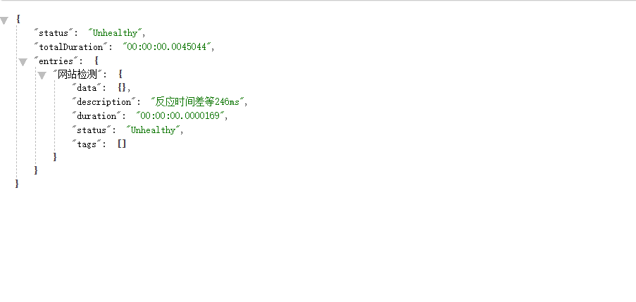
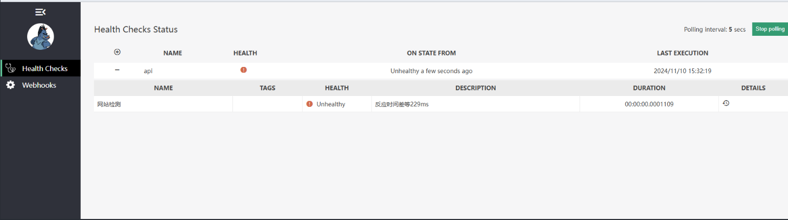

# HealthChecks



```bash
AspNetCore.HealthChecks.UI
AspNetCore.HealthChecks.UI.Client  
AspNetCore.HealthChecks.UI.InMemory.Storage  
```

## 编写RandomHealthCheck.cs

只是demo

```csharp
using Microsoft.Extensions.Diagnostics.HealthChecks;

namespace ContactSMS.WebAPI.HealthCheck;

public class RandomHealthCheck : IHealthCheck
{
    public Task<HealthCheckResult> CheckHealthAsync(HealthCheckContext context, CancellationToken cancellationToken = default)
    {
        int responseTimeInMs = Random.Shared.Next(300);

        if (responseTimeInMs < 100)
        {
            return Task.FromResult(HealthCheckResult.Healthy($"反应时间优等{responseTimeInMs}ms"));
        }
        else if (responseTimeInMs < 200)
        {
            return Task.FromResult(HealthCheckResult.Degraded($"反应时间良等{responseTimeInMs}ms"));
        }
        else
        {
            return Task.FromResult(HealthCheckResult.Unhealthy($"反应时间差等{responseTimeInMs}ms"));
        }
    }
}

```


## 在Program.cs新增配置

<mark style="color:red;">**有我的项目配置了jwt，需要授权，所以需要排除**</mark>

```csharp
// ... other code  
builder.Services.AddHealthChecks()
    .AddCheck<RandomHealthCheck>("网站检测");
builder.Services.AddHealthChecksUI(opts =>
{
    opts.AddHealthCheckEndpoint("api", "health");
    opts.SetEvaluationTimeInSeconds(5);
    opts.SetMinimumSecondsBetweenFailureNotifications(10);
}).AddInMemoryStorage();

builder.Services.AddAuthorization(options =>
{
    // 有我的项目配置了jwt，需要授权，所以需要排除
    options.AddPolicy("HealthCheck", policy =>
    {
        policy.RequireAssertion(_ => true); // 允许所有访问
    });
    options.AddPolicy(PolicyContstants.MustHaveEmployeeId, policy =>
    {
        policy.RequireClaim("employeeId");
    });
    options.AddPolicy(PolicyContstants.MustBeTheOwner, policy =>
    {
        policy.RequireClaim("title", "Business owner");
    });
    options.FallbackPolicy = new AuthorizationPolicyBuilder()
    .RequireAuthenticatedUser()
    .Build();
});

// 有我的项目配置了jwt，需要授权，所以需要添加HealthCheck
app.MapHealthChecks("/health", new HealthCheckOptions
{
    ResponseWriter = UIResponseWriter.WriteHealthCheckUIResponse
}).RequireAuthorization("HealthCheck");
app.MapHealthChecksUI().RequireAuthorization("HealthCheck");
```


## 效果

[http://localhost:5220/health](http://localhost:5220/health)

<figure><figcaption></figcaption></figure>

{% embed url="http://localhost:5220/healthChecks-UI#/healthchecks%EF%BC%8C" %}

<figure><figcaption></figcaption></figure>
