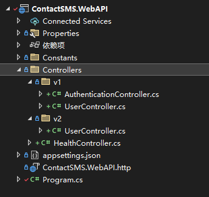

# 版本控制

## 包安装

```bash
Asp.Versioning.WebApi
Asp.Versioning.Mvc.ApiExplorer
```

## 项目接口

<figure><figcaption></figcaption></figure>

1. Program.cs配置版本

```csharp
// ... code ....

// 用于添加 Swagger 生成服务
builder.Services.AddSwaggerGen(opts =>
{
    var title = "API版本";
    var desc = "API版本";
    var terms = new Uri("http://localhost:5220");
    var license = new OpenApiLicense()
    {
        Name = "许可证"
    };
    var contact = new OpenApiContact()
    {
        Name = "xuzizheng",
        Email = "wan19950504@gmail.com",
        Url = terms,
    };
    // OpenApiInfo: 包含有关 API 文档的信息，包括版本、标题、描述、服务条款、许可证和联系信息。
    // SwaggerDoc: 定义每个 API 版本的 Swagger 文档。在这里，为 v1 和 v2 版本分别创建了文档。
    opts.SwaggerDoc("v1", new OpenApiInfo
    {
        Version = "v1",
        Title = $"{title} v1(deprecated)",
        Description = desc,
        TermsOfService = terms,
        License = license,
        Contact = contact
    });
    opts.SwaggerDoc("v2", new OpenApiInfo
    {
        Version = "v2",
        Title = $"{title} v2",
        Description = desc,
        TermsOfService = terms,
        License = license,
        Contact = contact
    });
});
builder.Services.AddApiVersioning(opts =>
{
    // 当未指定版本时，使用默认版本
    opts.AssumeDefaultVersionWhenUnspecified = true;
    // 默认 API 版本
    opts.DefaultApiVersion = new(1, 0);
    // 在响应头中报告可用的 API 版本
    opts.ReportApiVersions = true;
}).AddApiExplorer(opts =>
{
    // 格式化 API 版本名称
    opts.GroupNameFormat = "'v'VVV";
    // 在 URL 中替换 API 版本  
    opts.SubstituteApiVersionInUrl = true;
});
// ... code ...
app.UseSwaggerUI(opts =>
{
    opts.SwaggerEndpoint("/swagger/v2/swagger.json", "v2");
    opts.SwaggerEndpoint("/swagger/v1/swagger.json", "v1");
});
```

* **`AddApiVersioning`**：添加 API 版本化服务。
* **`AssumeDefaultVersionWhenUnspecified`**：设置为 `true`，当客户端未指定版本时使用默认版本（1.0）。
* **`DefaultApiVersion`**：设置默认的 API 版本为 1.0。
* **`ReportApiVersions`**：在 API 响应头中包含可用的 API 版本。
* **`AddApiExplorer`**：与 API 版本化有关的额外配置。
  * **`GroupNameFormat`**：设置 API 版本的分组名称格式。
  * **`SubstituteApiVersionInUrl`**：在生成的 URL 中自动替换 API 版本。
* **`UseSwaggerUI`**：启用 Swagger UI 并配置 Swagger 文档的终结点。
* **`SwaggerEndpoint`**：为每个版本的 API 指定 Swagger 文档的路径，确保用户可以访问和查看不同版本的 API 文档。

2. v1用户控制器代码

```csharp
using Asp.Versioning;
using ContactSMS.WebAPI.Constants;
using Microsoft.AspNetCore.Authorization;
using Microsoft.AspNetCore.Mvc;

namespace ContactSMS.WebAPI.Controllers.v1;

[Route("api/v{version:apiVersion}/[controller]")]
[ApiController]
[ApiVersion(1.0)]
public class UserController : ControllerBase
{
    [HttpGet]
    [AllowAnonymous]
    public IEnumerable<string> Get()
    {
        return new string[] { "1", "1" };
    }
}

```

3. v2用户控制器代码

```csharp
using Asp.Versioning;
using Microsoft.AspNetCore.Authorization;
using Microsoft.AspNetCore.Mvc;

[Route("api/v{version:apiVersion}/[controller]")]
[ApiController]
[ApiVersion(2)]
public class UserController : ControllerBase
{
    [HttpGet]
    [AllowAnonymous]
    public IEnumerable<string> Get()
    {
        return new string[] { "2", "2" };
    }
}
```

4. 不同版本公用的控制器

```csharp
using Asp.Versioning;
using Microsoft.AspNetCore.Authorization;
using Microsoft.AspNetCore.Mvc;

namespace ContactSMS.WebAPI.Controllers;

[Route("api/[controller]")]
[ApiController]
[ApiVersionNeutral]
[AllowAnonymous]
public class HealthController : ControllerBase
{
    [HttpGet]
    [Route("ping")]
    public IActionResult Ping()
    {
        return Ok("ok");
    }
}
```


