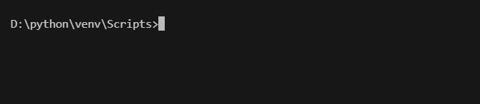

# window安装与使用  

## 安装python  

把下面的添加到环境变量中去，安装目录在哪里就填写哪里的。  
```bash  
C:\Python312\Scripts\  
C:\Python312\  
``` 

:::{seealso}  
这里默认安装到C盘，在开发新项目安装各种第三包会全局安装，C盘占用越来越大。所以推荐使用虚拟环境。  
比如在D盘中创建python目录，里面放虚拟环境和项目。  
:::


## 创建虚拟环境  
```bash  
python -m venv D:\python\venv
```  

运行命令之后如下图  
  

## 激活虚拟环境  

打开cmd进入，输入activate，成功激活如下图  


  

## 退出虚拟环境  

在cmd中输入deactivate即可  
  

## 运行项目  

在D:\python\找个目录下，有项目watermarkremover，进入根目录运行即可，如下图  
  
