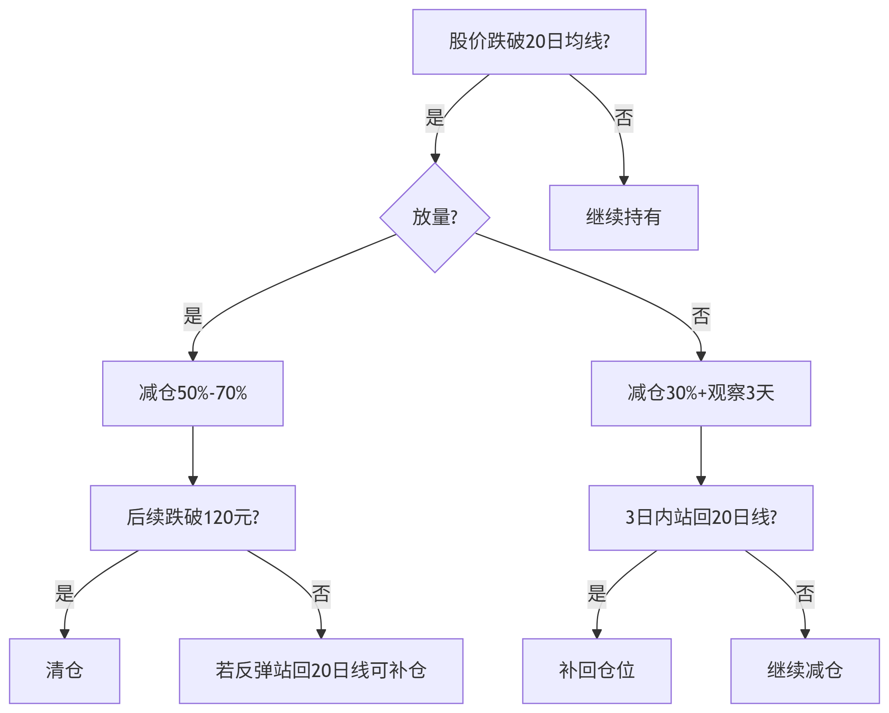

# 股票购买  

## 止盈策略  

- 阶梯止盈法（推荐）：
  - 第一目标（10%-15%）：130.61×1.15≈150元，卖出50%仓位（57股），锁定部分利润。
  - 第二目标（20%-25%）：130.61×1.25≈163元，再卖出剩余仓位的50%（约28股）。
  - 剩余仓位：若趋势强劲，可保留少量仓位博更高收益，但需动态跟踪。
- 技术止盈：
  - 跌破10日均线或MACD死叉时减仓。

### 一、如何查看「10日均线」是否跌破？

**1. 在K线图上添加均线**
  - 步骤（以同花顺/东方财富为例）：
    - 打开股票K线图（日线图）。
    - 点击「指标」或「设置」按钮（通常位于K线图右上角）。
    - 选择「均线（MA）」，一般默认显示5日、10日、20日均线（若无10日均线，可手动添加参数10）。
    - 确认后，K线图上会显示彩色的均线（如10日均线常为紫色或绿色）。

**2. 判断是否跌破**
  - 跌破信号：当日收盘价 低于 10日均线，且后续1-2天未能站回。
  - 示例：
    - 赛力斯当前股价130元，10日均线为135元 → 股价低于均线，视为跌破。
    - 若股价在均线附近波动，需观察是否有效跌破（建议结合成交量放大确认）。

### 二、如何识别「MACD死叉」？  
**1. 调出MACD指标**
  - 步骤：
    - 在K线图下方找到「指标区域」（通常显示成交量、MACD等）。
    - 选择「MACD」指标（若无，在指标库中搜索添加）。
    - MACD由三部分组成：
      - DIF线（快线，默认白色/蓝色）
      - DEA线（慢线，默认黄色/红色）
      - 柱状图（红绿柱，代表动能）。

**2. 识别死叉信号**
  - 死叉条件：
    - DIF线从上向下穿越DEA线，且柱状图由红转绿。
    - 死叉出现时，通常显示为两线交叉且MACD柱状图变为绿色。
  - 示例：
    - 若DIF线=2.0，DEA线=2.1 → DIF向下穿过DEA，形成死叉，提示短期下跌风险。

## 止损策略  

- 固定比例止损：
  - 建议止损位：亏损7%-10%（根据个人承受能力）。
  - 例如：130.61×0.93≈121.5元，跌破即止损（亏损约1,040元，占本金7%）。
- 技术止损
  - 跌破近期平台低点（如120元）或20日均线。
- 注意事项：
  - 避免因短期波动频繁止损，但需严格执行纪律。

### 跌破平台低点或20日均线  

**1. 关键定义**
  - **平台低点：**近期股价震荡的最低点（如120元）。
  - **20日均线：**动态值（如当前125.56元，需每日更新）。  

**2. 操作逻辑（分情况讨论）**  
|触发条件|操作建议|逻辑说明  
|-|-|-
|股价跌破120元|清仓|平台破位代表资金放弃防守，可能开启下跌趋势，需果断止损。
|股价跌破20日均线（125.56元）|减仓50%-70%|20日均线是中期趋势线，跌破可能转弱，但需观察3天能否收回（假跌破常见）。
|股价<120元且放量|立即清仓|放量破位=主力出逃，避免深套。
|股价<125.56元但缩量|减仓30%+观察|缩量跌破可能是洗盘，若3日内站回均线可补回。

**3. 您的案例（赛力斯买入价130.61元）**
  - 当前假设：
    - 平台低点=120元，20日均线=125.56元。
  - 具体操作：
    - 若股价跌至125.56元以下：
      - 第一步：减仓50%，剩余仓位设止损120元。
      - 第二步：若反弹至20日均线上方，可接回部分仓位。
  - 若股价跌至120元以下：
    - 无条件清仓，避免趋势恶化（亏损约8.1%）。

### 综合决策流程图  

### 注意事项
  - 平台低点的确认：
    - 需通过前期的K线低点确定（如120元是最近3周的最低点）。
  - 均线的滞后性：
    - 20日均线每天变化，若股价快速下跌，可能已远离均线，此时需参考平台低点。
  - 极端行情：
    - 若大盘暴跌（如单日-3%），个股可能被错杀，可等次日反弹再决策。

### 实际案例模拟（赛力斯）
  - **买入价：**130.61元
  - **触发情景1：**
    - 某日收盘价124元（跌破20日均线125.56元，成交量放大20%）。
    - 操作：减仓60%，剩余仓位止损设120元。
  - **触发情景2：**
    - 次日继续下跌至118元（跌破平台低点120元，放量）。
    - 操作：清仓剩余40%，总亏损≈9.6%。

## 减仓建议  
  - 触发条件：
    - 若同时出现跌破10日均线 + MACD死叉，减仓50%（如57股）以上。
    - 若仅其中一个信号，可观察1-2天确认趋势。
  - 示例操作：
    - 赛力斯跌破10日线且MACD死叉 → 卖出50%仓位（如57股），剩余仓位设止损持有。

## 示例操作计划
|操作|价格|数量|金额|逻辑  
|-|-|-|-|-  
|买入|130.61元|114股|14,890元|突破前期平台    
|止盈1|150元|57股|8,550元|达到15%目标
|止盈2|163元|28股|4,564元|趋势延续
|止损|121.5元|114股|13,851元|跌破7%止损线

 

