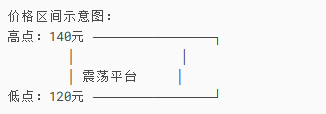

# 平台低点  

## **一、什么是“平台低点”？**  
平台低点是指股价在某一时间段内（如3周、1个月）反复震荡的最低点，通常代表多空博弈中多头的防守位置。一旦跌破，可能引发技术性抛售。

## **二、4步确定平台低点（以手机/电脑软件为例）** 

- **步骤1：调出日K线图**  
  - 打开交易软件（同花顺、东方财富等），输入赛力斯代码（601127），进入日K线界面。
  - 调整时间周期：默认显示近3个月数据，若需更精确，可缩小到最近20个交易日（约1个月）。
  
- **步骤2：识别震荡区间**
  - 观察股价是否在某一价格范围内横向波动（如下图示例）：
    - 
  - 确认条件：
    - 至少2次以上在120元附近止跌反弹（形成“双底”或“三底”更可靠）。
    - 每次反弹幅度≥5%（否则可能是偶然触碰）。

- **步骤3：标记关键低点**
  - 在K线图上找到最低的收盘价（非下影线）：
    - 例如：3周内最低收盘价是120.50元，下影线短暂刺破120元（取120.50元更稳妥）。
  - 若近期有放量阳线从120元拉起，则该点位支撑更强。

- **步骤4：验证有效性**
  - 成交量配合：
    - 在120元反弹时是否放量（资金介入迹象）。
  - 时间跨度：
    - 平台震荡时间越长（如1个月>3周），低点越有效。

## 实际案例（赛力斯假设数据）
假设赛力斯近期K线数据如下：

|日期|最低价|收盘价|成交量（万手）|关键行为
|-|-|-|-|-  
|2024/05/01|119.80|120.50|30|下影线探底后反弹
|2024/05/10|120.20|121.00|25|二次回踩不破
|2024/05/20|120.50|122.00|20|缩量确认支撑

**结论：**
- 平台低点确认为120.50元（收盘价未有效跌破）。
- 止损位设置：若收盘价跌破120元（比120.50元低约0.5%缓冲），触发清仓。

## 常见错误与修正
|错误做法|正确修正|原因
|-|-|-  
|仅看下影线最低价（如119元）|以收盘价为准|盘中闪崩可能被修复，收盘价代表多空最终结果。
|忽略成交量|结合放量反弹确认|无量跌破可能是假信号。
|平台周期过短（<2周）|至少观察3周以上数据|短期波动随机性强，长期平台更具参考价值。

## 动态调整平台低点
- **上移支撑：**若股价突破平台高点（如140元），新的平台低点可能上移至前一轮回踩点（如130元）。
- **下移支撑：**若股价放量跌破120元，下一个平台低点需重新寻找（如前期历史低点110元）。

## 操作总结（以赛力斯为例）
- 买入后：标记近期平台低点120元（假设已验证）。
- 持仓阶段：
  - 若股价接近120元但缩量→观察能否反弹。
  - 若收盘价跌破120元且放量→立即清仓。
- 后续跟踪：若股价站稳120元后反弹，可重新评估新的支撑位。