# 单根K线分析

## 什么是K线
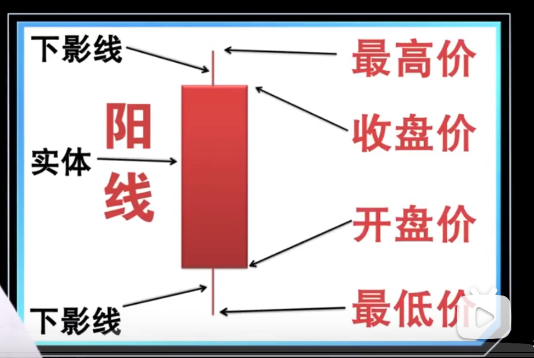
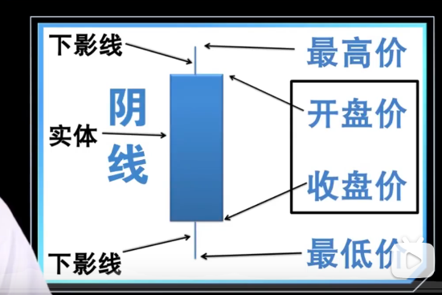  

## 大阳线

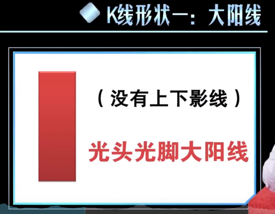

1. 大阳线实体部分较长，说明收盘价比开盘价要高出很多  
2. 大阳线的出现说明市场买方力量强大，后期应继续看好  
3. 光头光脚大阳线说明当天的开盘价就是最低价，收盘价就是最高价，后市继续看好  

## 大阴线

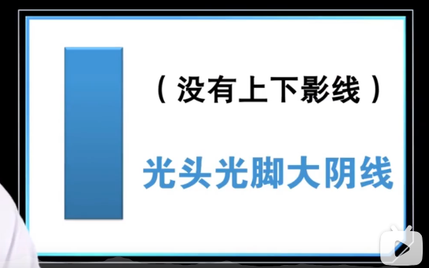
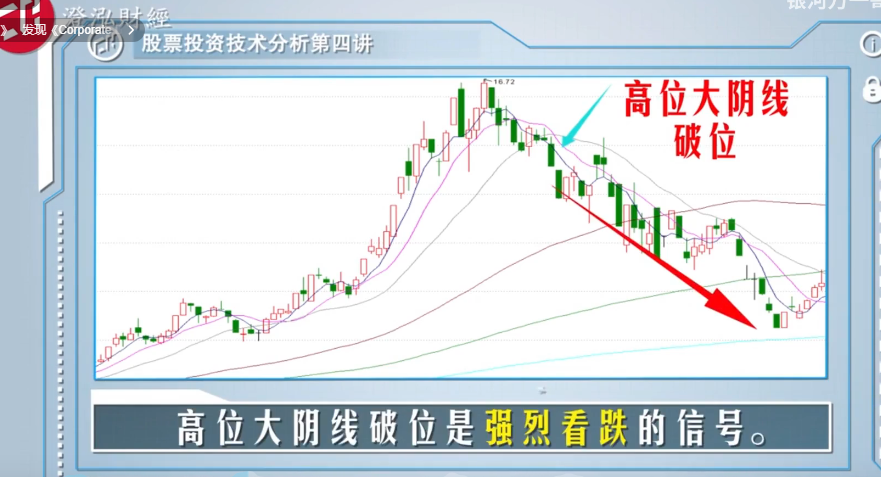
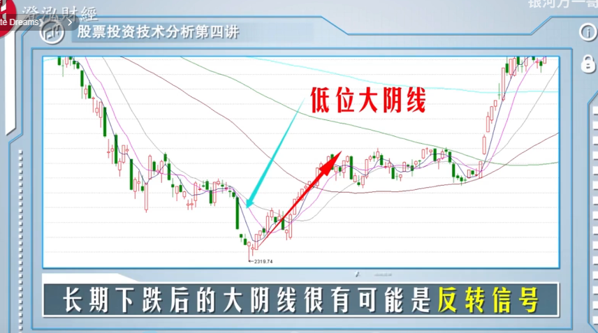

1. 大阴线说明当天几乎最高点开盘，然后最低点收盘，说明空方力量明显占优
2. 大阴线实体越长，跌的越多
3. 大阴线通常说明股价还会下跌，后市不被看好，但也有例外
4. 光头光脚大阴线说明开盘价就是最高价，收盘价是最低价是最不好的走势
5. 如果光头大阴线出现在高位，是强烈的看空信号

## 小阳线和小阴线

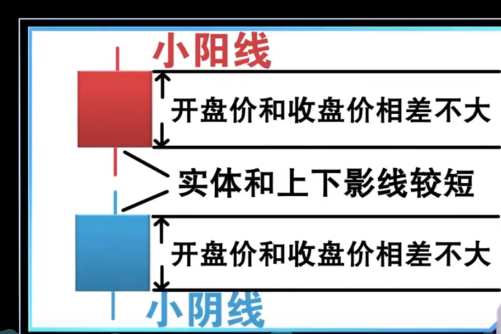
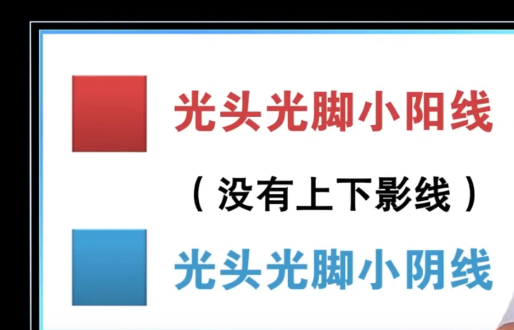

1. 小阳线表示上涨幅度不大，多方略微占优
2. 小阴线意味着跌幅不大，空头稍微占优

## 中阳线和中阴线

1. 比小阳线和小阴线实体更大一点的就是中阳线和中阴线
2. 一般涨跌幅度小于3%被称为小阳线或者小阴线
3. 超过3%小于6%我们称之为中阳线或者中阴线
4. 超过6%我们称之为大阳线或者大阴线

## 长影K线

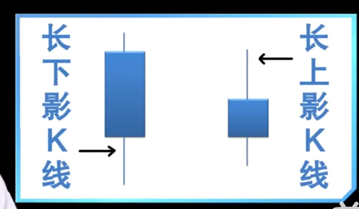

### 长上影K线
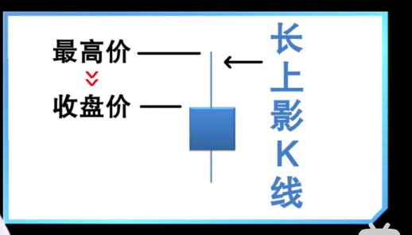
1. 长上影K线说明当天多方一度占优较大，但因空方打压或利空消息而而在尾盘有所回落
2. 长上影K线技术信号不明确，后市不一定看跌
3. 长上影K线在特定阶段被称为“仙人指路”
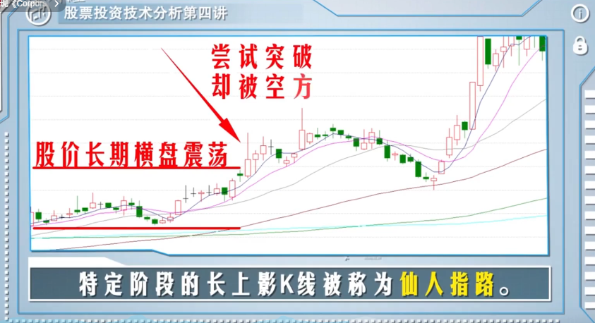
4. 长上影K线出现在高位，说明上方压力巨大，后市就不看好

### 长下影K线
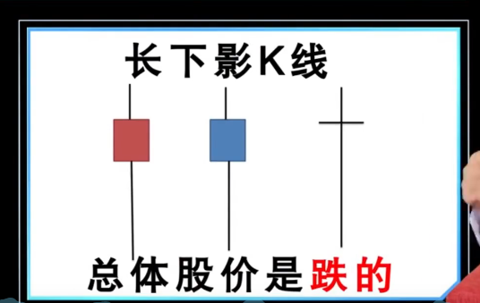

1. 下影线越长，下方支撑越强
2. 上影线越长，上方阻力越大
3. 连续几天出现长下影K线，是看多信号，后市更加看好
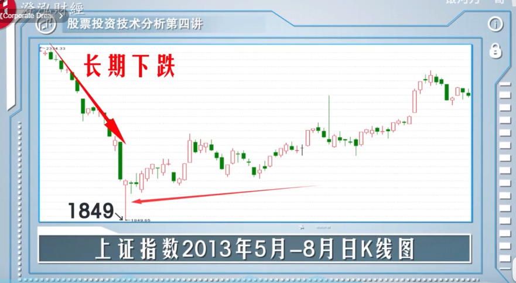
4. 高位的长下影线K线更可能是空头试探的打压行为
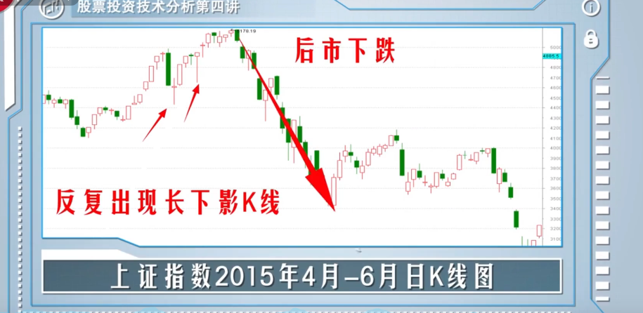

## 十字星
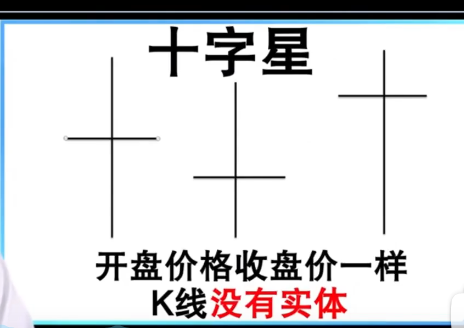

1. 高位和低位十字星都是行情逆转的信号
2. 行情中途出现的十字星一般是调整或反弹结束的信号
3. 震荡行情中出现十字星就是要突破震荡市的信号

## T字形和倒T字形
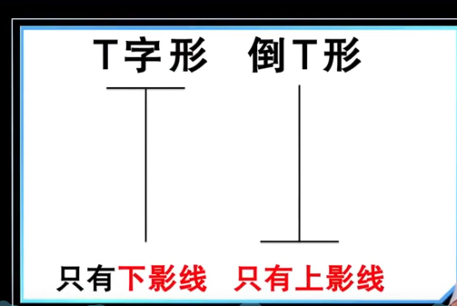

1. T字形K线对后市多方有利
2. T字形K线出现在股价的相对低位，是明显的看多信号
3. 倒T形K线说明股价冲高回落收盘价和开盘价一样，是明显的看空信号

## 一字形
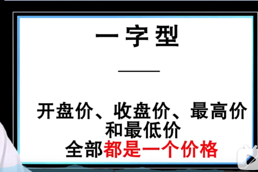

1. 一字涨停是突然出现利好消息买也买不到;一字跌停是突然出现利空消息卖也卖不掉